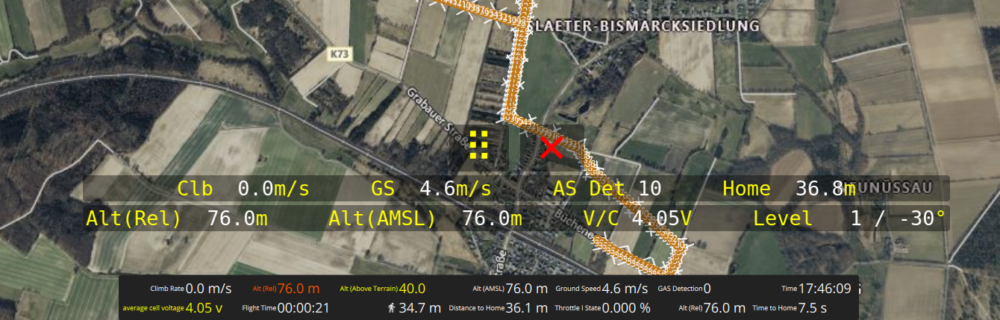

# 🛩️ Drone OSD — FPV-Style Transparent MAVLink Overlay

A lightweight **always-on-top** on-screen display for drone telemetry on Ubuntu.  
Perfect for **dual-monitor FPV** setups: one screen for QGroundControl, the other for your **Ant Media FPV feed** — with the OSD overlaying telemetry.

---

## ✨ Features
- 🟡 **Transparent overlay** with crisp Hi-DPI fonts  
- 🟨 Bright **Yellow labels** + **White values** for maximum visibility over video  
- 📊 Two-row layout with all key flight data  
- 🎛️ **Drag handle (⠿)** to move • **Close button (✕)** to exit  
- 🔌 Auto-requests MAVLink streams from PX4 / ArduPilot  
- 🔗 Works with **QGroundControl → MAVLink Forwarding** in real-time  
- 🔋 Shows **battery per-cell voltage** (set your own cell count)  
- 🛰️ “AS Det” field (currently mapped from GPS sats; can be replaced by any custom sensor)

---

## 🚀 Quick Start
```bash
# Dependencies
sudo apt update
sudo apt install -y python3 python3-pip python3-pyqt5
pip3 install pymavlink geographiclib

# Clone & run
git clone https://github.com/BeagleSystems/OSD.git
cd OSD
chmod +x osd.py
python3 osd.py
```

> **Default telemetry endpoint:** `udpin:0.0.0.0:14551`  
> *(Configure QGroundControl to forward MAVLink to this port — see below)*

---

## 🧩 Configuration “UI” (in `osd.py`)
Open **`osd.py`** and locate the **CONFIG** section near the top:

```
┌─────────────────────────── Configuration ─────────────────────────────┐
│ DEFAULT_ENDPOINT   = "udpin:0.0.0.0:14551"   # UDP input from QGC     │
│ DEFAULT_FONT_SIZE  = 20                      # Text size              │
│ DEFAULT_SCREEN     = 0                       # 0 = primary monitor    │
│ DEFAULT_ANCHOR     = "top"                   # top | bottom etc.      │
│ DEFAULT_MARGIN_PX  = 80                      # Offset from screen edge│
│ DEFAULT_CELL_COUNT = 4                       # Battery S-count (V/Cell)│
└────────────────────────────────────────────────────────────────────────┘
```

### OSD Fields (2 Rows)

| Row | Data Fields                                                        |
|-----|--------------------------------------------------------------------|
| 1   | Clb (m/s) • GS (m/s) • AS Det (placeholder) • Home (m)              |
| 2   | Alt(Rel) (m) • Alt(AMSL) (m) • V/Cell (V) • Level (roll/pitch °)    |

---

## 🔗 Connect to QGroundControl (Real-Time Telemetry)
1. Open **QGroundControl**  
2. Go to **Application Settings → MAVLink → Forwarding**  
3. Enable **“Forward MAVLink to an additional UDP endpoint”**  
4. Set **Host / Port** to:  
   ```
   127.0.0.1:14551
   ```  
5. Click **Apply** (restart QGC if needed).

The OSD listens on `udpin:0.0.0.0:14551` by default.  
If you choose another port in QGC, update `DEFAULT_ENDPOINT` in `osd.py` accordingly.

---

## 🖱️ Controls

| Icon          | Function                                |
|---------------|----------------------------------------|
| ⠿ Drag handle | Click & drag to reposition the OSD       |
| ✕ Close button| Exits the overlay                       |

Telemetry rows use a **40 % opacity black chip** for readability over live video.

---

## 🧪 Verify Telemetry Flow (Optional)
If you only see **dashes (—)**:

```bash
sudo tcpdump -i any udp port 14551
```

- Ensure QGC is actually forwarding data to that port  
- Make sure the OSD is using `udpin:` (receive mode, not `udp:`)  
- Disable any firewall / VPN blocking local UDP packets  

---

## 🖥️ Run by Double-Click (Optional Launcher)
Create a launcher file:

```bash
nano ~/.local/share/applications/osd.desktop
```

Paste:
```ini
[Desktop Entry]
Type=Application
Name=Drone OSD
Comment=Transparent FPV-Style MAVLink OSD
Exec=/usr/bin/env python3 /full/path/to/OSD/osd.py
Terminal=false
Icon=utilities-terminal
Categories=Utility;
```

Make it executable and (optionally) place on the Desktop:
```bash
chmod +x ~/.local/share/applications/osd.desktop
cp ~/.local/share/applications/osd.desktop ~/Desktop/
# → Right-click icon → “Allow Launching”
```

Tweak defaults in the **CONFIG** block so your double-click uses your preferred screen, margin, and endpoint.

---

## ⚠️ Troubleshooting

| Problem                     | Solution                                                   |
|-----------------------------|-----------------------------------------------------------|
| Dashes (—) everywhere       | Check QGC forwarding & port configuration                  |
| Battery V/Cell incorrect    | Set `DEFAULT_CELL_COUNT` to match your pack (3S/4S/6S etc.) |
| Home distance stays —      | Autopilot hasn’t sent **HOME_POSITION** yet (arm or GPS lock)|
| Level (roll/pitch) —       | Ensure **ATTITUDE** messages are being published            |

---

## 📷 Screenshot


---

## 📜 License
Licensed under the **MIT License**.

---

## 👤 Author
Developed by **Atiqur Rahman — Beagle Systems**  
Contributions welcome via **Issues / PRs**.
